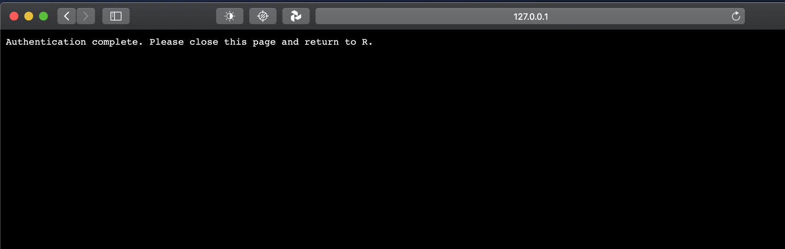

<style>
p.comment {
background-color: #DBDBDB;
padding: 10px;
border: 1px solid black;
margin-left: 25px;
border-radius: 5px;
font-style: italic;
}

</style>

```{r knitr setup, include=FALSE}
knitr::opts_chunk$set(echo = TRUE)
```

# 1 Loading packages

First, we're going to make sure we have all the necessary packages installed and loaded in our system. 


## 1.1 Pacman::p_load()

The `pacman::p_load()` function checks if a particular package is already installed in our library. If not, `p_load()` will install and load it. This function is especially useful when we use different computers or we share our `.rmd` files with colleagues as it helps setting up the session.

```{r install pacman, eval=FALSE, include=TRUE}
install.packages("pacman")
```

```{r load pacman}
library(pacman)
```


## 1.2 Installing the development version of `stringr`

Due to the fact we will be using some functions that are not in the version available on `CRAN`, we will be installing the development version of the `stringr` package, directly from the authors' github page.

```{r install stringr development version, eval=FALSE, include=TRUE}
# Check to see if we have the devtools package installed and loaded
pacman::p_load(devtools)

# Install stringr
devtools::install_github("tidyverse/stringr")
```


## 1.3 Load the necessary packages

Load the packages we will be using for our analysis.

```{r load packages}
pacman::p_load(# to download twitter data
               rtweet,
               
               # to import and save our data
               readr,
               
               # to shape and transform our data
               dplyr,
               forcats,
               
               # to manipulate strings
               stringi, 
               stringr, 
               rebus,
               qdapRegex,
               
               # to extract our lexicons for sentiment analysis
               textdata,
               
               # to perform sentiment analysis and topic modeling
               tidytext,
               
               # to plot our visuals
               wordcloud,
               ggplot2)
```


# 2 Importing data

## 2.1 Importing using rtweet

### 2.1.1 Authorize rtweet

We will capture twitter data using the `rtweet` package, which requires us to have an account in the platform. The first time we run the `rtweet::search_tweets()` or `search_tweets2()` functions, we will be prompted to grant permission to the package to use our Twitter credentials. The default browser on our OS will automatically open and ask for our username and password.


<br />

Upon signing in successfully, we will receive a confirmation that we have completed our authentication process.



<br />

### 2.1.2 Search terms

If we are interested in what people are *saying* about a particular subject or set of subjects, we need to select a set of keywords that will be used to find the relevant tweets.

Let us consider that we want to know how working people are experiencing the pandemic: we might be interested in how they are coping at work with the different restrictions in place, their experience of working from home, job hunting, being laid-off or fired, or their perception of how political leaders are handling the economy. We need to decide which terms will best capture work posts that are pandemic-related.

We can tentatively consider that the terms *work* and *job* are good keyword candidates for the task. However, since we are particularly interested in statements that take the pandemic into account, we will be using additional terms that will help narrow down our search. We can achieve that by including the terms *covid*, *coranavirus* and *pandemic* to a secondary search query in the same argument. Our goal is to collect posts that have at least one term from these two combined queries, such as *covid* and *work*, *pandemic* and *job*, or *covid* and *job*. Whenever we want to perform a search with **more than one query**, we need to **use** the `search_tweets2()` function.

<div class="alert alert-info"> For a thorough look at more arguments for the `search_tweets()` or `search_tweets2()` functions, consider the [documentation page](https://rtweet.info/reference/search_tweets.html). Or watch Matthew Hendrickson's presentation [An Introduction to `rtweet` - Getting & Analyzing Data From The Twitter API](https://youtu.be/mveDZ9k5Twc) at the 2020 DC satRdays conference.</div>

The way we build our query is by populating the `q =` argument. Spaces will be read as the `AND` operator and OR as the `OR` operator.

Since we will be focusing on personal tweets written in the English language, we can pass on a couple of additional arguments to `q =`: `-filter:quote` and `lang:en` will filter out any tweets with quotes and those written in any other languages besides English.

We can select the number of posts to collect, with the caveat that there is a maximum of 16,000 tweets per request, unless we have a developer account with the Twitter API. To circumvent that limit, we can set the `retryonratelimit =` to `TRUE`. `rtweet` will continue the capture after the 15 minute time limit is over.

As we are not necessarily interested in retweets, we also set the `include_rts =` to `FALSE`.

In addition, if we set up a developer account with Google Maps, we can use their API to capture tweets by location. This will allow us to use the `geocode =` argument and specify in our search particular values, such as coordinates, country, county, or city names.

```{r capture data from Twitter, eval=FALSE, include=TRUE}
tweets <- search_tweets2(
                      q = "work OR job covid OR coronavirus OR pandemic
                      -filter:quote lang:en",
                      n = 16000,
                      retryonratelimit = FALSE,
                      include_rts = FALSE)

# save the tweets into an .rds file
readr::write_rds(tweets, "data/tweets.rds")
```


## 2.2 Importing from file

If our data resides in an .rds file, we can use `readr`'s `read_rds()` function to import it into our session. In the event we have a collection of files with the data, we can use `dplyr`'s `bind_rows()` function to join them together row-wise. 

```{r load Twitter data from file, eval=TRUE, include=TRUE}
tweets <- bind_rows(read_rds("data/tweets.rds"),
                    read_rds("data/tweets2.rds"),
                    read_rds("data/tweets3.rds"),
                    read_rds("data/tweets4.rds"))
```


## 2.3 Inspect data

Let us take a brief look at our data.

### 2.3.1 Size

We have 91 variables and approximately 170,000 rows.

```{r inspect tweets}
dim(tweets)
```

### 2.3.2 Types of variables

Visualizing some of the variables.

```{r variables in tweets}
glimpse(tweets[1:10])
```

### 2.3.3 Text samples

Checking the `text` columns.

```{r sample text}
tweets$text[1:5]
```

### 2.3.4 User sources and devices

Checking the main Twitter sources gives us insight into the type of device used by user. They can help us filter out advertisers and bots, as well as identify non-commercial sources in case we would like to remove them as a data cleaning step.

```{r source table}
head(sort(table(tweets$source), decreasing = TRUE), n = 10)
```

### 2.3.5 Duplicate posts

There is always the possibility we will have duplicated tweets. One the one hand, it is not uncommon for a user to send the same recipient the exact same post two or more times. On the other hand, after we perform some data cleaning steps, such as removing user names, it is also possible to find exactly the same message sent by the same user to different recipients. 

```{r examples of duplicated tweets}
# Subsetting based on duplicate tweets
tweets$text[stringi::stri_duplicated(tweets$text) == TRUE][14:17]
```

# 3 Data preparation

Let us prepare our data for analysis by performing some data cleaning steps.

## 3.1 Cleaning the data

```{r data cleaning}
data <- tweets %>% 
  
  # only English tweets
  filter(lang == "en") %>% 
         
  # keep only user name and text columns
  select(screen_name, text) %>%
  
  mutate(# transform to lowercase
         text = str_to_lower(text),
         
         # remove all twitter handles
         text = str_remove_all(text, pattern = "@\\w{1,15}"),
         
         # remove any digits
         text = str_remove_all(text, pattern = "[[:digit:]]+"), 
         
         # remove html elements
         text = str_remove_all(text, "&amp;|&lt;&gt|&le;&ge"),
         
         # remove url links using qdapRegex package
         text = qdapRegex::rm_url(text, replacement = ""),
         
         # remove extra white spaces
         text = str_trim(text)) %>% 
  
         # remove duplicated tweets 
  subset(stringi::stri_duplicated(text) == FALSE) 

```


<div class="alert alert-info"> In the event we can't seem to find the right *regex*, test the patterns using Adam Spannbauer's *shiny app* [R Regex Tester](https://spannbaueradam.shinyapps.io/r_regex_tester/).</div>

## 3.2 Assessing the clean data

We now have two columns, `screen_name` and `text`, and a total of around 80,000 tweets.

```{r check the dimensions}
# Dimensions
dim(data)
```

Did we get rid of duplicates in the text column? What about in the user column: do we have more than one tweet by the same user?

```{r check for duplicates}
# check for duplicate tweets:
sum(stringi::stri_duplicated(data$text))

# check for duplicate users:
sum(stringi::stri_duplicated(data$screen_name))
```

We seem to have about 8500 tweets sent by the same users, despite that they are unique in content. Should we remove them?

```{r check duplicate users}
# sample of duplicate users
data$screen_name[stringi::stri_duplicated(data$screen_name) == TRUE][1:20]
```

# 4 Sentiment Analysis using *tidytext*


## 4.1 Tidying up the data

In order to apply the *tidytext* approach to our data, we need to transform our data by tokenizing each string and removing stop words.

```{r tidying up the data}
# We can add custom words to our stop_words list
# keywords_remove <- tibble(word = c("coronavirus", "covid", "pandemic",
#                                    "work", "job", "jobs"))
# 
# add keywords_remove to the stop_words list
# custom_stopwords <- tidytext::stop_words %>% 
#                      bind_rows(keywords_remove)

tidy_data <- data %>%

  # select the two columns in our data
  select(screen_name, text) %>%
  
  # remove any digits
  mutate(text = str_remove_all(text, pattern = "[[:digit:]]+")) %>% 

  # keep the tweet number
  mutate(tweet_number = row_number()) %>%

  # tokenize the tweets
  tidytext::unnest_tokens("word", text) %>%

  # remove stop words
  # note: choose between stop_words or custom_stopwords
  anti_join(tidytext::stop_words, by = "word")
```

## 4.2 Assessing word frequency

What are the most common words in our data?

```{r word frequency}
tidy_data %>% 
  count(word, sort = TRUE)
```

Visualizing the Top 15 words in our data.

```{r top 15 words}
tidy_data %>%
  count(word, sort = TRUE) %>% 
  top_n(15) %>% 
  mutate(word = fct_reorder(word, n)) %>% 
  ggplot(aes(x = word, y = n)) +
  geom_col() +
  coord_flip() +
  theme_bw() +
  labs(title = "Top 15 words",
       x = NULL,
       y = "Count")
```

### 4.2.1 Removing custom *stop words*

```{r removing custom stop words}
# add custom words to our stop_words list
keywords_remove <- tibble(word = c("coronavirus", "covid", "pandemic",
                                   "work", "job", "jobs"))

# add keywords_remove to the stop_words list
custom_stopwords <- tidytext::stop_words %>%
                     bind_rows(keywords_remove)

tidy_data <- tidy_data %>% 
  
  # remove custom_stopwords
  anti_join(custom_stopwords, by = "word")

# clean up the environment by deleting the custom words related objects
rm(keywords_remove, custom_stopwords)
```

#### 4.2.1.1 Visualizing word frequency without custom stopwords

```{r top 15 words with stopwords removal, message=FALSE}
tidy_data %>%
  count(word, sort = TRUE) %>% 
  top_n(15) %>% 
  mutate(word = fct_reorder(word, n)) %>% 
  ggplot(aes(x = word, y = n)) +
  geom_col() +
  coord_flip() +
  theme_bw() +
  labs(title = "Top 15 words",
       x = NULL,
       y = "Count")
```

```{r wordcloud}
wordcloud <- tidy_data %>% 
  count(word) %>%
  with(wordcloud(word, n, max.words = 150))

wordcloud
```

## 4.3 Loading the sentiment lexicons

In order for us to access different lexicons, we must ensure we have the `textdata` package installed. We will then be able to download, among others, the `Bing`, `Afinn`, and `nrc` lexicons. These are unigram lexicons and evaluate terms in different manners.


### 4.3.1 Bing

- `Bing` evaluates words based on a positive and negative polarity. It was first published in 2004 by Minqing Hu and Bing Liu.

```{r bing lexicon}
# save the Bing lexicon into lex_bing
lex_bing <- tidytext::get_sentiments("bing") 

# number of terms in the Bing lexicon
count(lex_bing)

# Bing polarity type
lex_bing %>% 
    count(sentiment)
```

### 4.3.2 Afinn

- `Afinn` on a scale from -5 to 5. It was published by Finn Ärup Nielsen in 2011.

```{r afinn lexicon}
# save the Afinn lexicon into lex_afinn
lex_afinn <- tidytext::get_sentiments("afinn") 

# number of terms in the Afinn lexicon
count(lex_afinn)

# Afinn polarity scale
lex_afinn %>% 
    count(value)
```

### 4.3.3 NRC

- The `nrc` lexicon evaluates both on a polarity level (positive and negative) and is designed to identify eight human emotions (anger, anticipation, disgust, fear, joy, sadness, surprise, trust) in text. It was published by Saif Mohammad and Peter Turney in 2013 and it requires a licence for commercial use.

```{r nrc lexicon}
# save the NRC lexicon into lex_nrc
lex_nrc <- tidytext::get_sentiments("nrc") 

# number of terms in the NRC lexicon
count(lex_nrc)

# NRC polarity scale
lex_nrc %>% 
    count(sentiment)
```

## 4.4 Applying sentiment analysis using the NRC lexicon

We will performing our sentiment analysis using the sentiment dictionaries by performing an `inner_join()`. In effect, we are merging the data with the lexicon.

```{r nrc analysis}
sa_nrc <- tidy_data %>% 
  inner_join(lex_nrc, by = "word") 

sa_nrc %>% 
  count(word, sort = TRUE) %>%
  mutate(word = fct_reorder(word, n)) %>% 
  top_n(20) %>% 
  ggplot(aes(x = word, y = n)) +
  geom_col() +
  coord_flip() +
  theme_bw() +
  labs(title = "Word Frequency",
       subtitle = "Analysis using the NRC lexicon",
       x = NULL,
       y = "Count")

sa_nrc %>%
  count(sentiment, sort = TRUE) %>%
  mutate(sentiment = fct_reorder(sentiment, n)) %>% 
  ggplot(aes(x = sentiment, y = n)) +
  geom_col() +
  coord_flip() +
  theme_bw() +
  labs(title = "Subjectivity and Polarity in Twitter Sample",
       subtitle = "Analysis using the NRC lexicon",
       x = NULL,
       y = "Count")
```

Let us look at some examples of tweets that have been labeled *positive* and *negative*.

```{r nrc extract negative examples}
head(data$text[sa_nrc$sentiment == "negative"])
```

```{r nrc extract positive examples}
head(data$text[sa_nrc$sentiment == "positive"])
```

## 4.5 Applying sentiment analysis using the Bing lexicon

```{r bing analysis, message=FALSE}
sa_bing <- tidy_data %>% 
  inner_join(lex_bing, by = "word") 

sa_bing %>% 
  count(word, sort = TRUE) %>%
  mutate(word = fct_reorder(word, n)) %>% 
  top_n(20) %>% 
  ggplot(aes(x = word, y = n)) +
  geom_col() +
  coord_flip() +
   labs(title = "Word Frequency",
       subtitle = "Analysis using the Bing lexicon",
       x = NULL,
       y = "Count")

sa_bing %>%
  count(sentiment, sort = TRUE) %>%
  mutate(sentiment = fct_reorder(sentiment, n)) %>% 
  ggplot(aes(x = sentiment, y = n)) +
  geom_col() +
  coord_flip() +
  labs(title = "Polarity Analysis",
       subtitle = "Analysis using the Bing lexicon",
       x = NULL,
       y = "Count")
```
Some examples of negative and positive tweets:

```{r bing extract positive samples}
# positive tweets
data$text[sa_bing$sentiment == "positive"][500:509]
```

```{r bing extract negative samples}
# negative tweets
data$text[sa_bing$sentiment == "negative"][500:509]
```

# Next steps


